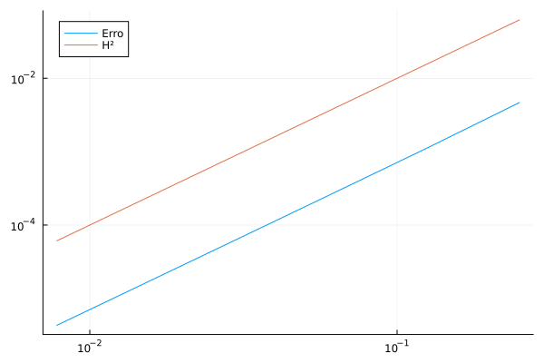

# Estudo da Convergência do Erro - Poisson

Aqui apresentaremos um exemplo de estudo da convergência do erro, no caso da equação de Poisson.

## Passo a passo

Começamos de forma análoga a [Equação de Poisson 2D](./poisson-2d.md)

```julia
using Fease

baseType = BaseTypes.linearLagrange

a = (0.0, 0.0)
b = (1.0, 1.0)
```

Agora, para a montagem da malha, implementamos uma contrutora de malha que dependa apenas da quantidade de intervalos nos eixos, no caso `NX`.

```julia
# Função que recebe uma tupla ou lista e retorna a malha montada com valores de baseType, a, b predefinidos
function monta_malha(NX)
  return monta_malha_2D_uniforme(baseType, NX..., a, b)
end
```

Em `monta_malha_2D_uniforme`, `NX` é seguido de reticências pois a função espera dois parâmetros antes de `baseType` e `a, b`. Portanto, esse `...` destaca cada elemento de `NX` individualmente.

Em seguida, defina os parâmetros do problema

```julia
α = 1.0
β = 1.0
f = (x₁, x₂) -> (2 * α * π^2 + β) * sin(π * x₁) * sin(π * x₂)
u = (x₁, x₂) -> sin(π * x₁) * sin(π * x₂)

# Define o pseudo operador linear a(u,v).
function pseudo_a(termos_equacao)
  (; ∇u, ∇v, u, v) = termos_equacao

  return β * dot(u, v) + α * dot(∇u, ∇v)
end

n_dims = 2
```

Para o estudo da convergência do erro, realizaremos uma sequência de sistemas com malhas cujos números de elementos sejam potências de dois, crescentes. Nesse exemplo, trabalharemos com $2^2$ até $2^7$

```julia
errsize = 7
NE = 2 .^ [2:1:errsize;]

H = 1 ./ NE # Considerando malhas com intervalos uniformes, a lista de intervalos para cada uma das quantidade de elementos em NE
E = zeros(length(NE)) # Vetor com os erros para cada uma das quantidades de elementos
```

A partir disso, podemos calcular a convergência do erro com

```julia
convergence_test!(E, NE, n_dim, monta_malha, pseudo_a, f, u)
```

Em seguida, plotamos o erro `H`x`E` junto com um gráfico `H`x`H²` para verificarmos o paralelismo e confirmarmos que o erro possui grau 2. Para isso, o plot é feito na escala logarítimica de forma que linearize o grau das curvas.

```julia
plot(H, E, xaxis = :log10, yaxis = :log10)
plot!(H, H .^ monta_base(baseType, 2).nB, xaxis = :log10, yaxis = :log10)
```


