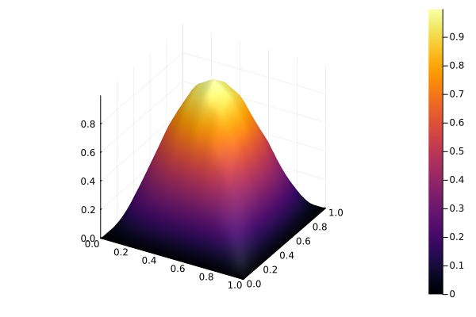

# Novo termo de Equação

Esta página é uma extensão do final da explicação da [Implementação Base](../desenvolvimento-colaborativo/implementacao-base.md). Se você quer uma explicação do que está sendo feito aqui, recomendamos que leia esta outra página.

## Preparando a implementação

Com o código-fonte em mãos, na pasta `src/testes`, crie um arquivo para testarmos o que implementaremos, por exemplo, `testes_novo_termo.jl`. Além disso, no final do arquivo `include_testes.jl`, na mesma pasta, inclua o recém criado.

```julia
include("testes_novo_termo.jl")
```

Em seguida, no arquivo criado, vamos implementar uma função chamada `novo_termo_2D`, para adicionar um novo termo de equação e testá-lo, em um espaço bidimensional. Essa função criada vai ter como base o exemplo em `example/Caso2D.jl`.

```julia
function novo_termo()
  # Define o número de sub-intervalos no eixo horizontal e vertical, respectivamente.
  Nx1, Nx2 = 8, 8

  # Define o tipo da base de funções interpoladoras do subespaço aproximado Vₘ.
  baseType = BaseTypes.linearLagrange

  # Define extremos do intervalo da malha.
  a = (0.0, 0.0)
  b = (1.0, 1.0)

  # Define a malha com os valores atribuídos acima.
  malha = monta_malha_2D_uniforme(baseType, Nx1, Nx2, a, b)

  # Define os parâmetros da equação a ser resolvida.
  α = 1.0
  β = 1.0
  f = (x₁, x₂) -> (2 * α * π^2 + β) * sin(π * x₁) * sin(π * x₂)

  # Define o pseudo operador linear a(u,v).
  function pseudo_a(termos_equacao)
    (; ∇u, ∇v, u, v) = termos_equacao

    return β * dot(u, v) + α * dot(∇u, ∇v)
  end

  # Monta e resolve o sistema linear relacionado a esta equação.
  c = solve_sys(f, malha, pseudo_a)

  # Imprime solução aproximada.
  show(c)

  # Plota solução aproximada.
  return plot_solucao_aproximada(c, malha, false)
end
```

Verifique se está tudo funcionando rodando a função `novo_termo_2D()`. Se aparecer o gráfico plotado, como abaixo, podemos seguir com o tutorial.


O gráfico, portanto, apresenta a solução aproximada do problema definido em [Equação similar à Poisson no espaço bidimensional](./poisson-2d.md), ou seja:

Dada uma função $f: \bar{\Omega} \to \mathbb{R}$ e constantes reais $\alpha > 0$ e $\beta \geq 0$, determine $u: \bar{\Omega} \to \mathbb{R}$ tal que

$$
\left\{
\begin{aligned}
-\alpha\Delta u(x) + \beta u(x) = f(x),\quad x\in \Omega\\
u(x) = 0, \quad x \in \Gamma
\end{aligned}
\right.
$$

sendo $\Omega$ um subconjunto do $\mathbb{R}^2$, $\Gamma$ a fronteira de $\Omega$ e $\bar{\Omega} = \Omega \cup \Gamma$.

A seguir apresentaremos como adaptar o código para conseguirmos resolver a seguinte variação da equação acima

$$
-\alpha(x)\Delta u(x) + \beta u(x) = f(x),\quad x\in \Omega.
$$

Em breve, adicionaremos o seu desenvolvimento na formulação fraca, necessária para montar a `pseudo_a` do problema.

## Implementando o novo termo

Vá no arquivo `src/examples.jl`. No final do arquivo, vamos adicionar, à estrutura `TermosEquacao`, um termo novo para que possamos adicinar uma parcela dependente de `x` na equacao.
Vamos chamar este novo termo de, simplesmente, `x`. A estrutura sairá de

```julia
struct TermosEquacao
  u
  v
  ∇u
  ∇v
end
```

para

```julia
struct TermosEquacao
  u
  v
  ∇u
  ∇v
  x
end
```

Para que esse novo termo possa ser considerado nos cáculos do problema, ele deve ser referenciado na funcão `montaKᵉ_geral!`, especificamente no _loop_ mais interno. A mudança é análoga à realizada em `TermosEquacao`, saindo de

```julia
termos_equacao = TermosEquacao(
  ϕᵉ_b,
  ϕᵉ_a,
  ∇ϕᵉ_b,
  ∇ϕᵉ_a
)
```

para

```julia
termos_equacao = TermosEquacao(
  ϕᵉ_b,
  ϕᵉ_a,
  ∇ϕᵉ_b,
  ∇ϕᵉ_a,
  x
)
```

Agora basta utilizá-lo. De volta no arquivo inicial `testes_novo_termo.jl`, vamos alterar a definição de `α` e, portanto, remova sua definição original trocando

```julia
α = 1.0
```

Pela função exemplo

```julia
α(x₁, x₂) = x₁ + x₂
```

Além disso, vamos precisar definir uma outra função

```julia
∇α(x₁, x₂) = [1 1]
```

Agora precisamos alterar como a `pseudo_a` funciona. Começamos acrescentando o termo `x` que criamos na extração dos termos da equação, alterando o trecho

```julia
(; ∇u, ∇v, u, v) = termos_equacao
```

para

```julia
(; ∇u, ∇v, u, v, x) = termos_equacao
```

Por fim, mudamos a utilização da variável para tornar-se uma chamada de função, ou seja, de

```julia
return β * dot(u, v) + α * dot(∇u, ∇v)
```

para

```julia
return β * dot(u, v) + α(x...) * dot(∇u, ∇v) + dot(dot(∇α(x...), ∇u), v)
```

Note que ambas `α` e `∇α` recebem o ponto `x` com um _splatting_, ou seja, no conjunto `x...`. Além disso, a parcela extra `dot(dot(∇α(x...), ∇u), v)` é uma consequência de tornar $\alpha$ uma função na equação.

Note que ambas `α` e `∇α` recebem o ponto `x` com um _splatting_, ou seja, no conjunto `x...`, pois é o padrão que utilizamos para uma função receber mais de uma variável a partir de uma tupla. Assim, a definimos esperando duas variáveis de forma que o código base não precise saber essa quantidade de variáveis.

Ao final de todas essas alterações, a função `novo_termo_2D` ficará assim:

```julia
function novo_termo()
  # Define o número de sub-intervalos no eixo horizontal e vertical, respectivamente.
  Nx1, Nx2 = 8, 8

  # Define o tipo da base de funções interpoladoras do subespaço aproximado Vₘ.
  baseType = BaseTypes.linearLagrange

  # Define extremos do intervalo da malha.
  a = (0.0, 0.0)
  b = (1.0, 1.0)

  # Define a malha com os valores atribuídos acima.
  malha = monta_malha_2D_uniforme(baseType, Nx1, Nx2, a, b)

  # Define os parâmetros da equação a ser resolvida.
  α = 1.0
  β = 1.0
  f = (x₁, x₂) -> (2 * α * π^2 + β) * sin(π * x₁) * sin(π * x₂)

  # Define o pseudo operador linear a(u,v).
  function pseudo_a(termos_equacao)
    (; ∇u, ∇v, u, v) = termos_equacao

    return β * dot(u, v) + α(x...) * dot(∇u, ∇v) + dot(dot(∇α(x...), ∇u), v)
  end

  # Monta e resolve o sistema linear relacionado a esta equação.
  c = solve_sys(f, malha, pseudo_a)

  # Imprime solução aproximada.
  show(c)

  # Plota solução aproximada.
  return plot_solucao_aproximada(c, malha, false)
end
```

Verifique novamente se está tudo funcionando rodando a nova função `novo_termo_2D()`. Se aparecer o gráfico plotado, igual ao de antes das mudanças, as alterações foram realizadas com sucesso!


Você também pode aplicar o tutorial de [Estudo de Convergência do Erro](../tutoriais/convergencia.md) e verificar se a convergência do erro segue o esperado. Caso contrário, revise seu código e encontre o erro.
