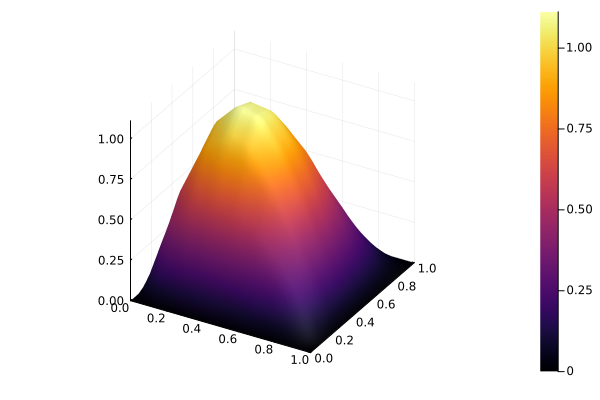

# Novo termo de Equação

Esta página é uma extensão do final da explicação da [Implementação Base](../desenvolvimento-colaborativo/implementacao-base.md). Se você quer uma explicação do que está sendo feito aqui, recomendamos que leia esta outra página.

## Preparando a implementação

Com o código-fonte em mãos, na pasta `src/testes`, crie um arquivo para testarmos o que implementaremos, por exemplo, `testes_novo_termo.jl`. Além disso, no final do arquivo `include_testes.jl`, na mesma pasta, inclua o recém criado.

```julia
include("testes_novo_termo.jl")
```

Em seguida, no arquivo criado, vamos implementar uma função chamada `novo_termo_2D`, para adicionar um novo termo de equação e testá-lo, em um espaço bidimensional. Essa função criada vai ter como base o exemplo em `example/Caso2D.jl`, acrescentando uma chamada de função para plotar a solução aproximada encontrada.

```julia
function novo_termo_2D()
  # Carrega os parâmetros de entrada da EDP
  run_values = examples_2D(1)

  # Define parâmetros da malha e monta a estrutura inicial
  Nx1, Nx2 = 8, 8

  baseType = BaseTypes.linearLagrange
  base = monta_base(baseType, Nx1 * Nx2)

  a = (0.0, 0.0)
  b = (1.0, 1.0)
  malha = monta_malha_2D_uniforme(base, Nx1, Nx2, a, b)

  (; α, β, f) = run_values

  function pseudo_a(termos_equacao::TermosEquacao)
    (; ∇u, ∇v, u, v) = termos_equacao

    return β * dot(u, v) + α * dot(∇u, ∇v)
  end

  c_geral = solve_sys(f, malha, pseudo_a)

  plot_solucao_aproximada(c_geral, malha)

  return
end
```

Verifique se está tudo funcionando rodando a função `novo_termo_2D()`. Se aparecer o gráfico plotado, como abaixo, podemos seguir com o tutorial.


## Implementando o novo termo

Vá no arquivo `src/examples.jl`. No final do arquivo, vamos adicionar, à estrutura `TermosEquacao`, um termo novo para que possamos adicinar uma parcela dependente de `x` na equacao.
Vamos chamar este novo termo de, simplesmente, `x`. A estrutura sairá de

```julia
struct TermosEquacao
  u
  v
  ∇u
  ∇v
end
```

para

```julia
struct TermosEquacao
  u
  v
  ∇u
  ∇v
  x
end
```

Para que esse novo termo possa ser considerado nos cáculos do problema, ele deve ser referenciado na funcão `montaKᵉ_geral!`, especificamente no _loop_ mais interno. A mudança é análoga à realizada em `TermosEquacao`, saindo de

```julia
termos_equacao = TermosEquacao(
  ϕᵉ_b,
  ϕᵉ_a,
  ∇ϕᵉ_b,
  ∇ϕᵉ_a
)
```

para

```julia
termos_equacao = TermosEquacao(
  ϕᵉ_b,
  ϕᵉ_a,
  ∇ϕᵉ_b,
  ∇ϕᵉ_a,
  x
)
```

Agora basta utilizá-lo. De volta no arquivo inicial `testes_novo_termo.jl`, vamos alterar a definição de `α` e, portanto, remova sua definição original em

```julia
(; α, β, f) = run_values
```

Vamos defini-la como um função, exemplo,

```julia
α(x₁, x₂) = x₁ + x₂
```

Agora precisamos alterar como a `pseudo_a` funciona. Começamos acrescentando o termo `x` que criamos na extração dos termos da equação, alterando o trecho

```julia
(; ∇u, ∇v, u, v) = termos_equacao
```

para

```julia
(; ∇u, ∇v, u, v, x) = termos_equacao
```

Por fim, mudamos a utilização da variável para tornar-se uma chamada de função, ou seja, de

```julia
return β * dot(u, v) + α * dot(∇u, ∇v)
```

para

```julia
return β * dot(u, v) + α(x...) * dot(∇u, ∇v)
```

Aqui escolhemos passar o `x` junto com as reticências, pois é o padrão que utilizamos para uma função receber mais de uma variável a partir de uma tupla. Assim, a definimos esperando duas variáveis de forma que o código base não precise saber essa quantidade de variáveis.

Ao final de todas essas alterações, a função `novo_termo_2D` ficará assim:

```julia
function novo_termo_2D()
  # Carrega os parâmetros de entrada da EDP
  run_values = examples_2D(1)

  # Define parâmetros da malha e monta a estrutura inicial
  Nx1, Nx2 = 8, 8

  baseType = BaseTypes.linearLagrange
  base = monta_base(baseType, Nx1 * Nx2)

  a = (0.0, 0.0)
  b = (1.0, 1.0)
  malha = monta_malha_2D_uniforme(base, Nx1, Nx2, a, b)

  (; β, f) = run_values

  α(x₁, x₂) = x₁ + x₂

  function pseudo_a(termos_equacao::TermosEquacao)
    (; ∇u, ∇v, u, v, x) = termos_equacao

    return β * dot(u, v) + α(x...) * dot(∇u, ∇v)
  end

  c_geral = solve_sys(f, malha, pseudo_a)

  plot_solucao_aproximada(c_geral, malha)

  return
end
```

Verifique novamente se está tudo funcionando rodando a nova função `novo_termo_2D()`. Se aparecer o gráfico plotado, como abaixo, as alterações foram realizadas com sucesso!

