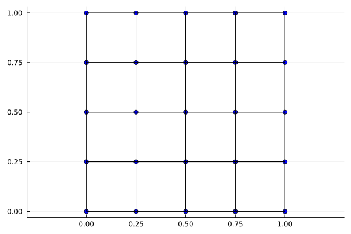
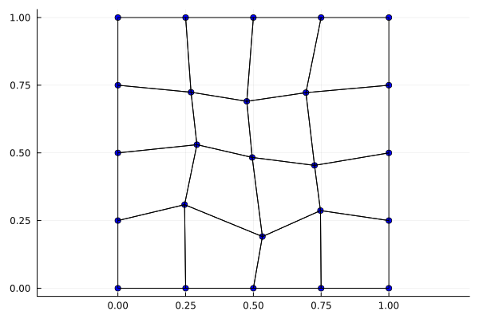
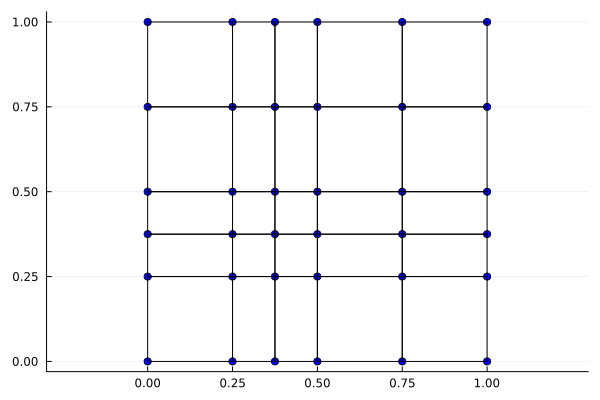
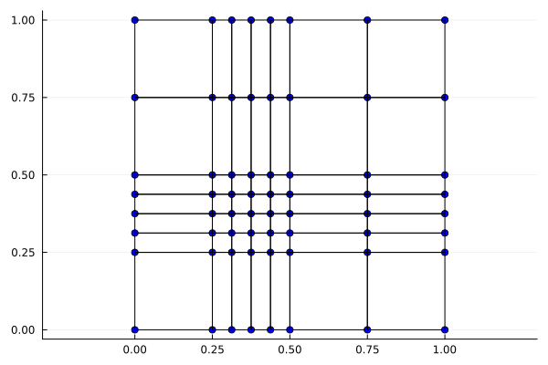
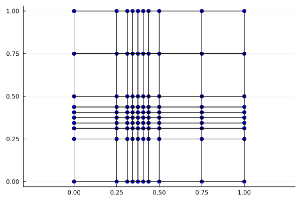

# Outras malhas disponíveis

Aqui apresentaremos algumas opções de malha para utilizar diferentes da uniforme apresentada em [Equação de Poisson 2D](./poisson-2d.md).

## Malha com ruído

Essa é uma malha derivada da uniforme na qual seus nós internos se distanciam da posição original com um valor aleatório dentro de um intervalo específico. Este valor é o que chamamos de ruído, neste caso.

### Passo a passo

Primeiro, construa a malha uniforme

```julia
Nx1, Nx2 = 4, 4

baseType = BaseTypes.linearLagrange

a = (0.0, 0.0)
b = (1.0, 1.0)

malha = monta_malha_2D_uniforme(baseType, Nx1, Nx2, a, b)
```

Vamos plotar essa nova malha construída utilizando uma das funções internas de plot

```julia
plot_malha_2D(malha)
```



Agora, para aplicar o ruído é simples, basta fazer

```julia
malha = malha2D_adiciona_ruido(malha)

plot_malha_2D(malha)
```

Resultando na malha


Apenas destacamos que o ruído aleatório varia, naturalmente, entre execuções distintas do programa.

## Malha com concentração de elementos em ponto focal

Essa próxima malha também deriva da uniforme, porém de forma distinta. Neste caso chamamos outra função montadora. Sua chamada é muito parecida com a primeira, com um dois parâmetros a mais: `ponto_foco` e `precisao`.

```julia
Nx1, Nx2 = 4, 4

baseType = BaseTypes.linearLagrange

a = (0.0, 0.0)
b = (1.0, 1.0)

ponto_foco = (0.375, 0.375)
precisao = 0

malha = monta_malha_2D_foco(baseType, Nx1, Nx2, a, b, ponto_foco, precisao)
```

O `ponto_foco` é um ponto na malha que vai se tornar, se já não for, um ponto com quatro elementos adjacentes. Na figura abaixo, temos a malha com o ponto de foco em $(0.375, 0.375)$, ponto este que não existia na malha uniforme, de onde derivamos.

```julia
plot_malha_2D(malha)
```



A `precisao` é a quantidade de iterações de incremento de intervalos em torno do `ponto_foco`. Com `precisao = 1` os intervalos mais próximos à esquerda e à direita do ponto focal serão divididos em dois, assim como os intervalos mais proximos acima e abaixo.

```julia
ponto_foco = (0.375, 0.375)
precisao = 1

malha = monta_malha_2D_foco(baseType, Nx1, Nx2, a, b, ponto_foco, precisao)

plot_malha_2D(malha)
```



Assim notamos que o número de elementos próximos ao ponto focal é maior que originalmente. Isso permite uma precisão maior em determinadas regiões.

```julia
ponto_foco = (0.375, 0.375)
precisao = 2

malha = monta_malha_2D_foco(baseType, Nx1, Nx2, a, b, ponto_foco, precisao)

plot_malha_2D(malha)
```


