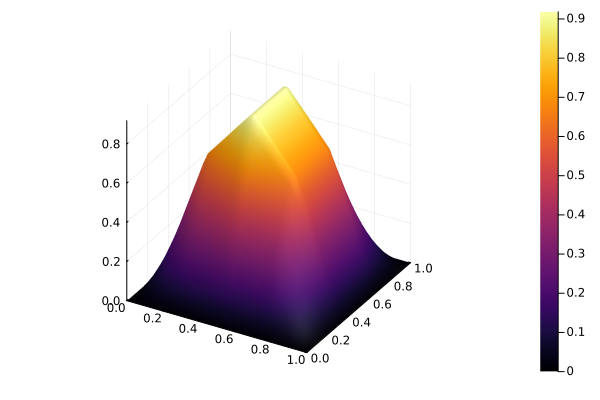

# Equação similar à Poisson no espaço bidimensional

Para este tutorial é esperado que você tenha seguido o passo a passo em [Para começar a utilizar](../para-comecar/para-começar-a-utilizar.md). As próximas etapas serão parecidas com as apresentadas no artigo.

## A equação

Como apresentado no título, a equação a ser resolvida é similar à de Poisson, com uma parcela extra. Portanto, vamos ao problema:

Dada uma função $f: \bar{\Omega} \to \mathbb{R}$ e constantes reais $\alpha > 0$ e $\beta \geq 0$, determine $u: \bar{\Omega} \to \mathbb{R}$ tal que

$$
\left\{
\begin{aligned}
-\alpha\Delta u(x) + \beta u(x) = f(x),\quad x\in \Omega\\
u(x) = 0, \quad x \in \Gamma
\end{aligned}
\right.
$$

sendo $\Omega$ um subconjunto do $\mathbb{R}^2$, $\Gamma$ a fronteira de $\Omega$ e $\bar{\Omega} = \Omega \cup \Gamma$.

Assim, o que queremos é encontrar uma solução aproximada de $u$ com o Fease.jl. A seguir temos o passo a passo para obtê-la.

## Passo a passo

Comece importando o pacote

```julia
using Fease
```

Defina o tipo do conjunto de funções da base e a quantidade de intervalos em ambas as dimensões, assim como o número de elementos, considerando uma malha retangular uniforme.

```julia
baseType = BaseTypes.linearLagrange

Nx1, Nx2 = 4, 4
```

Em seguida, defina os pontos de intervalo da malha e chame uma função para construção da malha. Nesse exemplo, utilizaremos `monta_malha_2D_uniforme`.

```julia
a = (0.0, 0.0) # Inicio do intervalo
b = (1.0, 1.0) # Fim do intervalo

malha = monta_malha_2D_uniforme(baseType, Nx1, Nx2, a, b)
```

Agora, definimos alguns parâmetros do problema

```julia
alpha = 1.0
beta = 1.0
f = (x₁, x₂) -> (2 * alpha * π^2 + beta) * sin(π * x₁) * sin(π * x₂)
u = (x₁, x₂) -> sin(π * x₁) * sin(π * x₂)
```

Em seguida, montamos uma função que referencia o operador bilinear $a(u,v)$ com parâmetros obtidos de `run_values`.

```julia
function ref_op_a(termos_equacao::TermosEquacao)
  (; ∇u, ∇v, u, v) = termos_equacao

  return β * dot(u, v) + α * dot(∇u, ∇v)
end
```

Enfim, com a `f` e a malha definidas e o operador $a(u, v)$ referenciado, basta resolver o sistema, com

```julia
C = solve_sys(f, malha, ref_op_a)
```

Resultando em

```julia-repl
6-element Vector{Float64}:
 0.6591976796035088
 0.9322462987801565
 0.6591976796035092
 0.659197679603509
 0.9322462987801566
 0.6591976796035091
```

Com esse resultado também é possível utilizar um método implementado internamente para plotar esse resultado,

```julia
plot_solucao_aproximada(C, malha, false)
```

Resultando no gráfico



Você também pode aplicar o tutorial de [Estudo de Convergência do Erro](../tutoriais/convergencia.md) e verificar se a convergência do erro segue o esperado. Caso contrário, revise seu código e encontre o erro.
